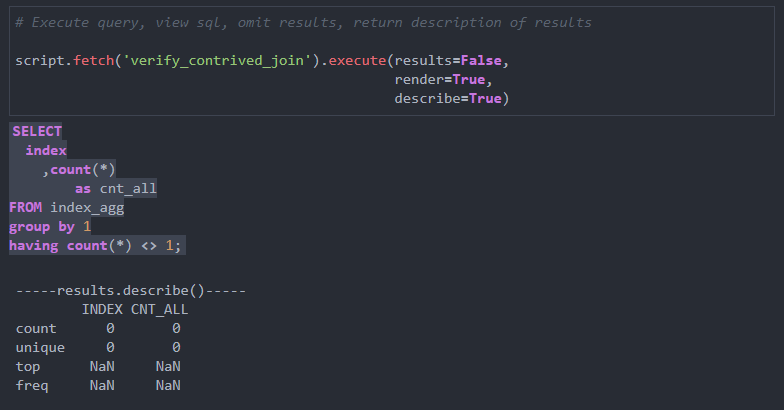

[](https://badge.fury.io/py/snowmobile)
[](https://github.com/GEM7318/Snowmobile/blob/master/LICENSE.txt)
[](https://snowmobile.readthedocs.io/en/latest/?badge=latest)

# snowmobile

`snowmobile` is a simple set of modules for streamlined interaction with the Snowflake Database for Data Scientists and Business Analysts.

As such the included codes are intended to be used for the execution of raw SQL and don't make use an ORM to map Python objects to tabular Snowflake
counterparts.

A quick overview of simplified usage is outlined below.

---
## Basic usage
1. Install with `pip install snowmobile`

2. Create file called *snowflake_credentials.json* following the below structure with as many sets of credentials
as desired and store anywhere on local file system
    ```json
    {
        "Connection1": {
        "username":	"",
        "password":	"",
        "role": "",
        "account": "",
        "warehouse": "warehouse #1",
        "database":	"database #1",
        "schema": "schema #1"
      },
        "SANDBOX": {
        "username":	"",
        "password":	"",
        "role": "",
        "account": "",
        "warehouse": "warehouse #1",
        "database":	"database #1",
        "schema": "SANDBOX"
      }
    }
    ```
   
3. Import desired modules and execute a statement to test connection
    ```python
    # bundled authentication & statement-execution module  
    from snowmobile import snowquery
      
    # Instantiate an instance of a connection
    sf = snowquery.Connector(conn_name='SANDBOX')
      
    # Execute statements on that connection 
    sample_table = sf.execute_query('SELECT * FROM SAMPLE_TABLE')
    ```

<br></br>
# Modules

## Overview

All modules are included in the build for transparency & flexibility purposes, although the majority of use cases will run on the front-end modules that make use of the others along the way.

#### Front-end / primary utilities 
- `snowquery` instantiates a connection and provides an `execute_query()` method for executing statements against and querying data from the warehouse
- `snowloader` flexibly loads data from a local DataFrame into a table within the warehouse in the form of a `df_to_snowflake()` function, bundling a variety of utilities that standardize column names pre-loading, check DataFrame's structure compared to the table to be loaded into, and executes 
DDL in absence of a pre-existing table 
- `snowscripter` parses and instantiates components of raw .sql scripts into Python objects for much easier interaction, particularly particularly as it relates to single-statement execution and rendering statements as markdown when executed in IPython environments as well as easy execution of full .sql files


#### Back-end / supporting
- `snowcreds` locates the credentials file on a user's local file system
- `snowconn` establishes a connection to the database and returns a **conn** object

A more in-depth description of of each module and its usage outlined below.

---
## snowquery

#### Description
`snowquery` simplifies the execution of sql statements against the database via an `execute_query()` 
method, using [pandas'](https://pandas.pydata.org/) `pd.read_sql` function to execute the SQL and  returning results from the DataBase as a [dataframe](https://pandas.pydata.org/pandas-docs/stable/reference/api/pandas.DataFrame.html) by default.

**please note**: `snowquery` is intended to streamline execution of sql that is typed *within* a Python script
and is better-suited for ad-hoc statements whereas `snowscripter` imports an external .sql file & extracts its components into Python objects that come with cleaner methods for execution.


#### Usage
Its usage to query via set of credentials stored in _snowflake_credentials.json_ labeled **SANDBOX** is as follows.

```python
In[1]:
from snowmobile import snowquery

# Establishes snowquery.Connector() object with which statements can be excuted 
sf = snowquery.Connector(conn_name='SANDBOX')

# Executing a simple sql string
sample = sf.execute_query('select * from sample_sandbox_table')

# Verifying returned object
type(sample)
```
```
Out[1]
pandas.core.frame.DataFrame
```

---
## snowscripter

### Description

`snowscripter` imports an external .sql file & transforms it into Python objects on which methods can be called to perform a variety of actions.

The `Script` object is instantiated with the following three arguments, of which only `path` is required for successful instantiation.

```python
    def __init__(self, path: str, pattern: str = r"/\*-(\w.*)-\*/",
                 snowflake: snowquery.Connector = ''):
        """Instantiating an instance of 'script' by calling Script class on a
        full path to a sql script.

        Args:
            path: Full path to SQL script including .sql extension
            pattern: Regex pattern that SQL statement headers are wrapped in
            snowflake: Instantiated snowquery.Connector instance to use in the
            execution of Script or Statement objects
        """ 
```


The usage for this module is broken up into **script-level** and **statement-level** usage below, the latter of which contains the majority of application.

---

### Usage (script-level)

In its simplest form, users can instantiate an instance of `script` by running the below where _path_ is a full file path to a .sql file.

```python
script = snowscripter.Script(path)
```

This will return a Script object on which the `.run()` method can be called to execute an entire script  sequentially statement by statement.

---

### Usage (statement-level)

##### Background
The real benefit of `snowscripter` comes from the use of 'header' tags within the sql script that form a link between a specified name and an individual statement - these identified in the parser by the regex pattern contained in the `pattern` argument of the object's instantiation.

The pattern's default is '**/\\\*-(\\w.*)-\\\*/**'  and will return all text between a standard sql block-comment whose contents are wrapped in an additional '-', such as:

```mysql
/*-sample_statement_header-*/
select 
   a.*
from...
```

To make this more clear, below is a walk-through usage illustration in which a sample table is created and then `scriptparser` is used to parse a few sql statements and execute them against the table.

##### Start Example

The following Python snippet is creates a dummy DataFrame and loading it to the warehouse for the
exercise.

*Setup / creating dummy data*

```python
# Up-front setup for snowscripter usage
import numpy as np
import pandas as pd
from snowmobile import snowloader, snowquery

# Creating dummy df 
df = pd.DataFrame({f"col{i}": 
                   np.random.normal(0, 1, 1000) for i in range(0, 10)}).reset_index()

# Instantiating instance of a specified connection to run on for demo 
demo_conn = snowquery.Connector('demo')

# Loading into a table called SAMPLE_TABLE
snowloader.df_to_snowflake(df, table_name='SAMPLE_TABLE', force_recreate=True, snowflake=demo_conn)
```


**Local .sql file**

Now that we have a sample table to query against, consider two statements stored in the .sql file
below.

```mysql
--snowscripter_sample.sql

/*-contrived_example_aggregation-*/
create or replace temp table index_agg as with
contrived_1 as (
  select
    index
    ,sum(col1) as col1
  from SAMPLE_TABLE
  group by 1
),
contrived_2 as (
  select
    index
    ,sum(col1) as col2
  from SAMPLE_TABLE
  group by 1
)
  select
    a.*
    ,b.col2
  from contrived_1 a
  inner join contrived_2 b
    on a.index = b.index;

/*-verify_contrived_join-*/
SELECT
  index
	,count(*)
		as cnt_all
FROM index_agg
group by 1
having count(*) <> 1;
```


**Instantiating parsed script object**

In Python, we can instantiate a `scriptparser.Script` object from this with:
```python
from snowmobile import snowscripter
  
# path_to_script = full path to .sql file
script = snowscripter.Script(path_to_script, snowflake=demo_conn)
```


**Accessing & executing statements**

Now instantiated, we can work with different parts of our script either through the `script` object or extracting individual `Statement` objects & associated methods from `script`.

A few different examples of this are as follows

1. Accessing a single statement from the `script` object's namespace as a string (**not** recommended)

    ```python
   sample1 = script.statement.get('contrived_example_aggregation')
   type(sample1)  # str
   ```
   
   
   
2. Accessing a single statement as a `Statement` object via the `.fetch()` method on the `script` object (**recommended**)

   ```python
   sample_statement_obj = script.fetch('contrived_example_aggregation')
   type(sample_statement_obj)  # snowmobile.snowscripter.Statement
   ```
   This method is preferred because the `snowmobile.snowscripter.Statement` object comes with the following three methods:
   - `.execute()` which executes the statement
   - `.render()` which renders the syntactic-code as a markdown in IPython environments 
   - `.raw()` which renders the raw sql as a string similarly to Option 1 above

   

3. To access these methods for all statements, the `.get_statements()` method call on the `script` object will return an itterable containing instantiated `Statement` objects for all statements in the script

   ```python
   itterable_statements = script.get_statements()
   for statement_header, statement in iterable_statements.items():
      # statement_header will iterative through [contrived_example_aggregation, verify_contrived_join]
      # statement will be Statement objects from associated sql with access to .execute(), .render(), .raw()
   ```


**Executing and rendering statements simultaneously**

Lastly, it's often helpful to execute a statement as well as render the sql behind it.

To avoid having multiple method calls in these instances, the `.execute()` method comes with arguments for executing without returning results, rendering the underlying sql, and printing out a description of the returned results if desired.

Below is a screenshot of what this looks like from within a notebook.



---
## snowloader
`snowloader` streamlines the bulk-loading protocol outlined in the [Snowflake documentation](https://docs.snowflake.com/en/user-guide/data-load-overview.html)
in the form of a `df_to_snowflake()` function and is intended to be a one-stop solution for the quick loading of data.

Its main features are:
- Standardizing of DataFrame's columns prior to loading into the warehouse
- DDL creation & execution if a pre-defined table to load data into doesn't exist 
- Parameter-based flexibility to append DataFrame's contents or replace pre-existing contents
- Returns a boolean indicating whether or not a load was successful for exception-handling when iteratively loading/appending multiple files
into a single table.

Continuing on the example above, the below will convert all columns in the _sample_table_ DataFrame to floats and re-load it into the warehouse,
executing new-DDL to create the table with float data types and loading all data back into the table.

```python
import numpy as np
import pandas as pd
from snowmobile import snowloader, snowquery

# Creating dummy df 
df = pd.DataFrame({f"col{i}": 
                   np.random.normal(0, 1, 1000) for i in range(0, 10)}).reset_index()

# Instantiating instance of a specified connection to run on for demo 
demo_conn = snowquery.Connector('demo')

# Option 1 
snowloader.df_to_snowflake(df=df, table_name='SAMPLE_TABLE', force_recreate=True,
                            snowflake=demo_conn)

# Option 2 
snowloader.df_to_snowflake(df=df, table_name='SAMPLE_TABLE', force_recreate=True)
```

In the above,
- *Option 1* will load the data back into Snowflake on the same connection that was established in the
  `sf = snowquery.Snowflake(conn_name='SANDBOX')` statement by use of the `snowflake=sf` parameter
- In *Option 2* this argument is omitted and the function will instantiate a new connection based on the first set of credentials in **snowflake_credentials.json**


In general and particularly when iteratively loaded multiple files into the database, it will be faster to instantiate a single instance of `snowquery`
that's passed into the `df_to_snowflake()` function so that it does not need to find, read-in and parse the credentials file each time its called.

---
## snowcreds

##### Description

`snowcreds` is a single class intentionally extracted for easier evolving along with security standards, 
its instantiation of `Credentials()` accepts the below two arguments and associated defaults
```python
def __init__(self, config_file: str = 'snowflake_credentials.json',
                 conn_name: str = '') -> None:
        """Instantiates an instance of credentials file.
        
        Args:
            config_file: Name of .json configuration file following the
            format of connection_credentials_SAMPLE.json.
            conn_name: Name of connection within json file to use, will
            use first set of credentials in the file if no argument is passed.
        """
        self.config_file = config_file
        self.conn_name = conn_name
```

It contains a single `.get()` method that will traverse a user's file system from the bottom-up until it finds a filename
that matches the `config_file` parameter and unless specified otherwise via the `conn_name` parameter will return the first set of credentials
stored in the **.json** file.  

*The .json file itself is assumed to store its credentials following [this](https://github.com/GEM7318/Snowmobile/blob/master/connection_credentials_SAMPLE.json) format*
<br></br>

##### Usage

**Note**: The instantiation of `snowcreds` is somewhat verbose and has been left us such for the time being as it is a back-end utility and not intended
to be called by the users explicitly

```python
In[1]:
from snowmobile import snowcreds
creds = snowcreds.Credentials(config_file='sample_credentials.json').get()
```
```
Out[1]:
Locating & importing credentials..
	<1 of 4> Searching for sample_credentials.json in local file system..
	<2 of 4> Located & loaded sample_credentials.json from:
		C:\User\Desktop\sample_credentials.json
	<3 of 4> No explicit connection passed, fetching 'Connection1' credentials by default
	<4 of 4> Successfully imported credentials for conn_name='Connection1'
```

---
## snowconn

#### Description
`snowconn` is also comprised of a single class, `Connection()`, that inherits `Credentials()` to retrieve a set of credentials with which to establish a connection to the database.

Its instantiation and usage is very similar to `snowcreds` as it inherits the `config_file` and `conn_name` attributes and includes a `.get_conn()` method will authenticate using the credentials
returned by `snowcreds.get()`

#### Usage

The below codes instantiate an instance of Connection used in higher-level modules.

```python
In[1]:
from snowmobile import snowconn
creds = snowconn.Connection().get_conn()
type(creds)
```
```
Out[1]:
snowflake.connector.connection.SnowflakeConnection
```

---
---

# Appendix

# snowscripter

The below outputs all the attributes and methods associated with an instantiated `script` object


```python
In[1]:
attrs = {k: v for k, v in script.__dict__.items()}

print("---------/Attributes/---------")
for i, (k, v) in enumerate(attrs.items(), start=1):
    print(f"<a{i}> {k}:\n\t{type(v)}")
    

print("\n----------/Methods/---------")
for i2, k in enumerate(script.__dir__(), start=1):
    if str(k) not in list(attrs.keys()) and '__' not in str(k):
        print(f"<m{i2-18}> .{k}()")
    else:
        i2 -= 1
```
```
Out[1]:
---------/Attributes/---------
<a1> sql:
	<class 'snowmobile.snowscripter.Script'>
<a2> snowflake:
	<class 'snowmobile.snowquery.Connector'>
<a3> pattern:
	<class 're.Pattern'>
<a4> source:
	<class 'str'>
<a5> name:
	<class 'str'>
<a6> script_txt:
	<class 'str'>
<a7> list_of_statements:
	<class 'list'>
<a8> statement:
	<class 'str'>
<a9> statement_names:
	<class 'list'>
<a10> statements:
	<class 'dict'>
<a11> spans:
	<class 'dict'>
<a12> ordered_statements:
	<class 'list'>
<a13> header_statements:
	<class 'list'>
<a14> full_sql:
	<class 'str'>
<a15> returned:
	<class 'dict'>

----------/Methods/---------
<m1> .reload_source()
<m2> .run()
<m3> .get_statements()
<m4> .fetch()
<m5> .render()
<m6> .raw()
<m7> .execute()
```